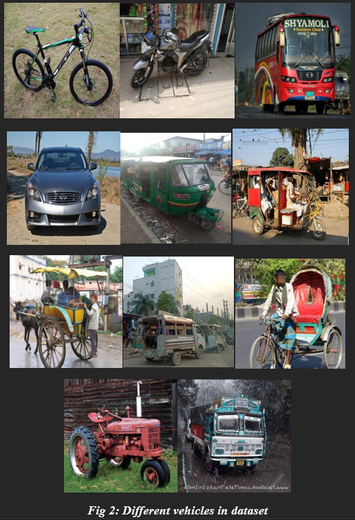
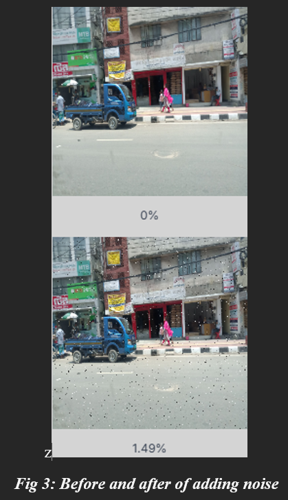
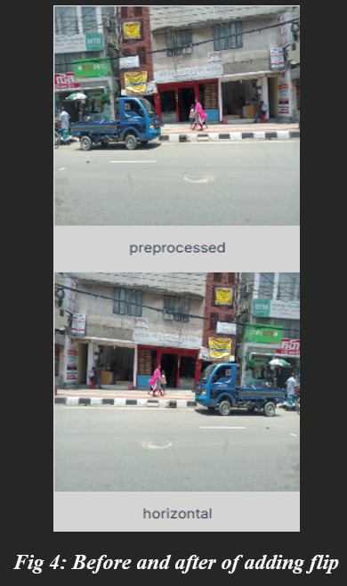
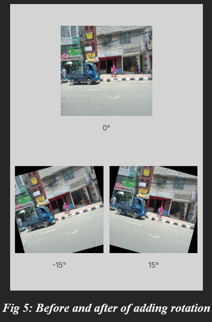
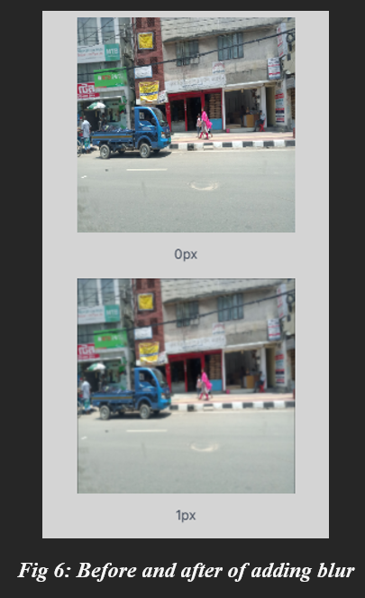
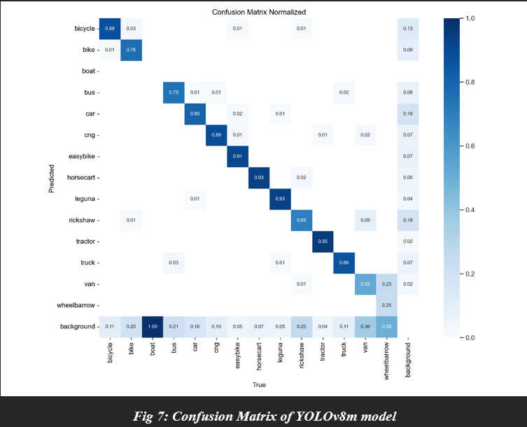
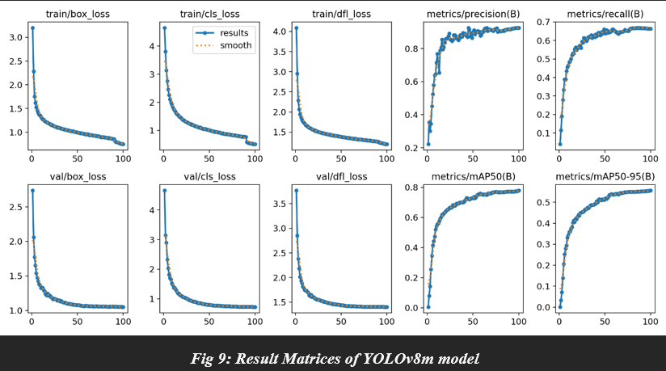

# Traffic-Management-system-using-Deep-Q

Nowadays traffic congestion in Urban areas is a major issue, leading to major delays, increased fuel consumption, and high pollution levels. Our project, Traffic Management System, aims to reduce congestion by optimizing traffic lights at major intersections of the city based on real time conditions. This project uses advanced trained YOLO-based vehicle detection to classify different vehicle types and simultaneously counting them by extracting frames from live video feeds from all sides of the crossing. These counts are then used to calculate the optimal time for traffic lights, reducing waiting time thus reducing congestion.
Unlike current traffic control systems, which mostly depend on pre-set timers, our project uses AI-powered solutions to adapt to real-world conditions, making it highly efficient and scalable. The test for this project is done using pre-collected images to simulate real-life traffic conditions. While the current system focuses on traffic optimization, future iterations may include emergency vehicle prioritization, traffic rule violation detection and hardware integration for live deployment.
Our project demonstrates how AI can be used to optimize traffic conditions in the country, offering a sustainable and smart solution.

## Dataset

The dataset used here includes 11 types of vehicles majorly used in India spanning with over 15000 images after augmentation methods. The vehicles in the data set are Bicycle, Bike, Bus, Car, CNG, Easy-bike, Horse-Cart, Leguna, Rickshaw, Tractor and Truck.

## Data Augmentation

The dataset was increased to this size with the help of augmentation methods. It is the easiest and most common way to increase the size of the dataset. The following operations were applied to the dataset:
The images below are in a format where the image on top is the actual image and the image(s) in bottom are the processed images.

### Noise

### Flip

### Rotation

### Blur

## YOLOv8 Results

Achieved a high precision of 92.5% indication that majority of the vehicles were classified correctly.

## ✨ Features

- Detects different vehicle types using YOLOv8
- Counts vehicles from live camera feeds
- Controls traffic lights based on traffic density using a DeepQ learning model

## 🛠️ Tech Stack

- **Backend**: Python, OpenCV, YOLOv8
